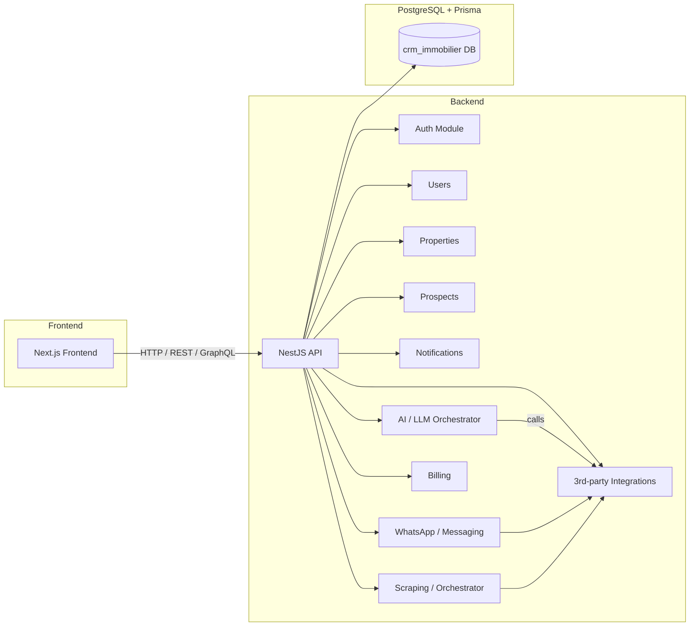
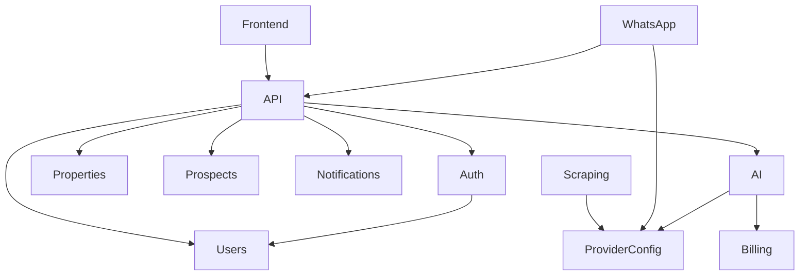

# MAJ 2026-01-17 — Architecture & Cartographie des modules

Date: 2026-01-17

Résumé exécutif
- Ce document centralise l'architecture actuelle du projet, les modules backend/frontend/BDD et les correctifs prioritaires identifiés lors des analyses.

## 1) Vue d'ensemble (haut niveau)

Notes:
- Le backend est structuré en modules NestJS (contrôleurs + services + modules + Prisma client).
- La base de données est gérée via Prisma (fichier `backend/prisma/schema.prisma`) et migrations dans `backend/prisma/migrations`.

## 2) Liste des modules (extraction initiale)
- Backend (principaux modules identifiés) :
  - `Auth` (authentification/ACL)
  - `Users` (gestion utilisateurs / comptes)
  - `Properties` (biens, annonces)
  - `Prospects` (leads / prospects)
  - `Notifications` (email/push)
  - `AI` / LLM Orchestrator (`LlmConfig`, `AiUsage`, `AiPricing`, etc.)
  - `WhatsApp` / Messaging (`WhatsAppConfig`, Twilio, webhooks)
  - `Billing` / Facturation (consommation AI / crédits)
  - `ProviderConfig` / Intégrations (API keys pour fournisseurs)
  - `Scraping` / Orchestrator (collecte web)
  - `Agency` / multi-tenant wrappers (api keys par agence)
  - `Admin` / paramétrage global (`GlobalSettings`)

- Frontend (principaux modules / zones) :
  - Next.js app (pages + app router selon structure)
  - Auth client / session handlers (localStorage, cookies)
  - Dashboard / pages: propriétés, prospects, notifications, intégrations
  - Modules UI pour: intégrations LLM, tests API, configuration WhatsApp
  - Clients HTTP (axios/fetch wrappers) et hooks (SWR / react-query)

- Base de données (tables / domaines visibles via Prisma) :
  - Tables liées à l'AI : `ai_usages`, `ai_pricings`, `ai_errors`, `llm_configs` (ou variants mapping)
  - Tables intégrations / providers : `provider_configs`, `agency_api_keys`, `whatsapp_configs`
  - Domain entities : `users`, `properties`, `prospects`, `transactions`, `mandates`
  - Paramètres globaux : `global_settings`, `ai_settings`

> Remarque: la liste ci-dessus est produite à partir du `schema.prisma` et des migrations inspectées; je peux exécuter une lecture automatisée des modules exacts si vous voulez la liste complète et précise.

## 3) Diagramme de dépendances détaillé (modules -> modules)

## 4) Correctifs / actions prioritaires (déjà identifiés)
1. DB name-mapping mismatch (haute priorité)
   - Contexte: logs montrent des erreurs liées aux différences entre noms de tables générés par les migrations (ex: "LlmConfig") et les noms utilisés par Prisma avec `@@map("llm_configs")`.
   - Action recommandée:
     - Comparer `backend/prisma/schema.prisma` vs schéma réel (via `npx prisma db pull --print`) et harmoniser les `@@map` ou renommer les tables existantes.
     - Fournir SQL non destructif pour renommer ou créer vues si nécessaire (ex: `ALTER TABLE "LlmConfig" RENAME TO llm_configs;`) — vérifier dépendances avant exécution.

2. Secrets stockés en clair (haute priorité)
   - Colonnes identifiées contenant clés/API: `ai_settings.openaiApiKey`, `agency_api_keys.*ApiKey`, `provider_configs.apiKey`, `provider_configs.apiSecret`, `whatsapp_configs.accessToken`, `whatsapp_configs.twilioAuthToken`.
   - Action recommandée:
     - Retirer les secrets des tables ou chiffrer au repos (pgcrypto) ou migrer vers un secret manager (Vault/Azure Key Vault/GCP Secret Manager).
     - Rechercher occurrences dans le code (commits, .env, scripts) et supprimer les secrets hardcodés.

3. Migrations / Prisma version (moyenne priorité)
   - Contexte: plusieurs migrations existantes et une note de mise à jour Prisma majeure.
   - Action recommandée:
     - Valider l'état des migrations avec `npx prisma migrate status` et résoudre toute migration partiellement appliquée (utiliser `prisma migrate resolve` si besoin).
     - Planifier mise à jour vers la version Prisma ciblée en staging et tester.

4. Indexation & performances (moyenne priorité)
   - JSONB / champs fréquemment interrogés (ex: recherche full-text, filtres par metadata) doivent avoir GIN indexes.
   - Action recommandée:
     - Ajouter indexes GIN sur colonnes JSONB et indexs B-tree sur colonnes de jointure fréquente.

5. Frontend ↔ Backend: cohérence API (moyenne priorité)
   - Problèmes repérés: usages de `localStorage` pour des tokens, clients HTTP multiples, endpoints du frontend non alignés avec backend.
   - Action recommandée:
     - Centraliser client HTTP, standardiser format d'erreurs et schema des réponses, éviter stockage de tokens sensibles dans localStorage (préférer httpOnly cookie ou secure storage).

6. Tests & E2E (faible → moyenne)
   - Reprendre la suite E2E (Playwright) et les guides README restants; assurer tests pour flux critiques (auth, lead creation, LLM calls, whatsapp webhooks).

## 5) Plan d'action proposé (court terme)
- Étape 1 (immédiate, lecture seule): exécuter un inventaire automatisé des tables Prisma vs tables réelles et lister les divergences exactes.
- Étape 2: préparer un patch SQL non destructif pour renommer/mapper les tables (ou mettre à jour `schema.prisma`) et valider en staging.
- Étape 3: migrer secrets sensibles hors base ou chiffrer, conserver historique dans une migration dédiée.
- Étape 4: ajouter indexs proposés + tests de performances sur requêtes lentes.
- Étape 5: synchroniser Frontend/Backend API contract et ajouter tests E2E.

## 6) Pièces jointes / emplacements utiles
- Prisma schema: `backend/prisma/schema.prisma`
- Migrations: `backend/prisma/migrations/`
- Env DB: `backend/.env` (veillez à ne pas commiter de secrets)

---
Si vous souhaitez, je peux :
- exécuter l'inventaire exact automatique et joindre la liste complète des divergences (tables + colonnes),
- générer le SQL de correction non destructif pour revue,
- ou étoffer le diagramme Mermaid (par module et services internes) en scannant le code source pour extraire noms exacts des modules.

Indiquez quelle action vous voulez que je lance ensuite.

(📁 Fichier créé: `MAJ_2026-01-17.md`)
